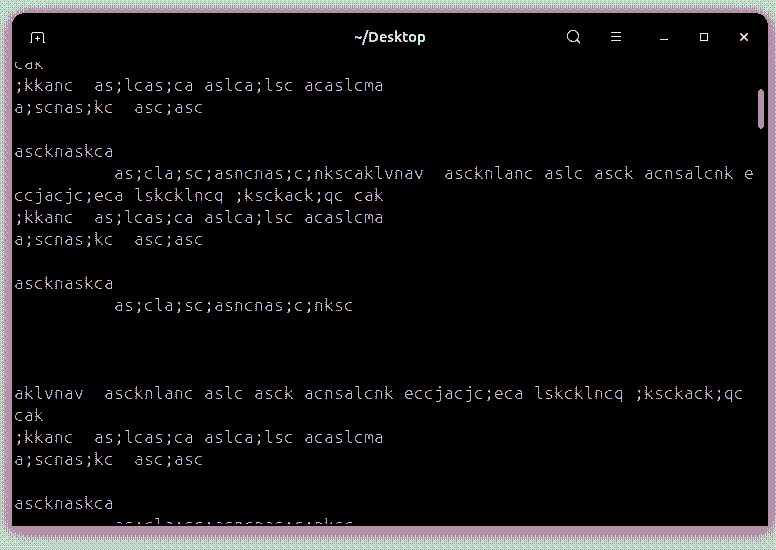
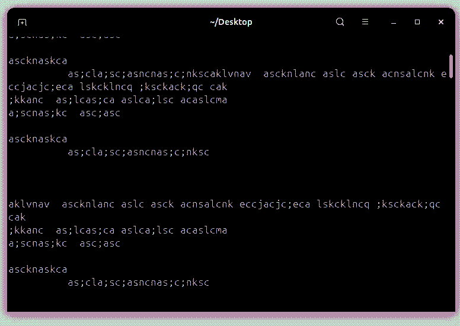

# smooth_scroll
*Smooth scrolling for Linux*


<p align="center">
  
  
</p>

## setup:
```
sudo chmod +x setup.sh
```
next:
```
./setup.sh
```

#### This script installs a smooth scrolling mouse driver/service on Linux. It creates a hidden folder named ".smooth_scroll" in the current directory, compiles a C++ program called smoothscroll, and sets it up as a systemd service so it runs automatically at boot.

## WARNINGS:

* The script installs the following packages using `apt: build-essential and g++`. It runs `sudo apt update` and `sudo apt install -y build-essential g++`. Make sure you have sudo access and an internet connection.

* It creates a hidden directory: `.smooth_scroll` (note the leading dot). Inside it, you will find the source file "smoothscroll.cpp" and the compiled binary "smoothscroll".

* The C++ source code contains comments in Persian **(Farsi)** because the author is Iranian. These comments are only in the `.cpp` file, not in the shell script itself.

* The program is installed and run as a systemd service named `smoothscroll.service`. This service runs as root and starts automatically after multi-user.target.

* After the system boots, the smooth scroll service may take a few seconds to become fully active. Wait a moment before testing.

* The service grabs the real mouse device (EVIOCGRAB) and creates a virtual uinput device. If the service crashes, the real mouse may be temporarily locked until the service restarts.

---
USEFUL COMMANDS:

To check the status of the service:
```
sudo systemctl status smoothscroll.service 
```
To stop the service:
```
sudo systemctl stop smoothscroll.service
```
To start the service:
```
sudo systemctl start smoothscroll.service
```
To restart the service:
```
sudo systemctl restart smoothscroll.service
```
To enable the service at boot (already done by the script):
```
sudo systemctl enable smoothscroll.service
```
To disable the service at boot:
```
sudo systemctl disable smoothscroll.service
```
To view live logs:
```
sudo journalctl -u smoothscroll.service -f
```
To remove the service and the hidden folder:
```
sudo systemctl stop smoothscroll.service
sudo systemctl disable smoothscroll.service
sudo rm /etc/systemd/system/smoothscroll.service
sudo systemctl daemon-reload
rm -rf .smooth_scroll
```

---
### telegram :
```
https://t.me/mry_shell
```
